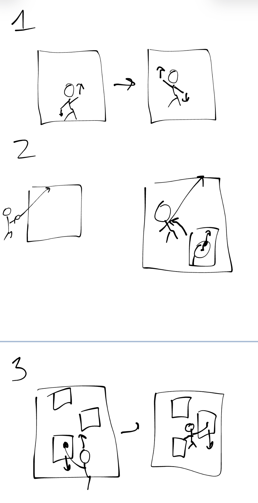

# Project Proposal Template

Ascending a wall

Alex Arnold

## Interaction Description

The interaction will be getting over some kind of wall by climbing it.

1. Shaking both controllers up and down next to the wall will cause the player to ascend as a function of the velocity of the controllers
1. Shoot a rope using ray casting and use the joystick to move along the rope's path
1. Specific portions of the wall will be climbable. When a controller is touching that section the player can hold the trigger to "stick" and pull down to ascend. 

## Storyboards

